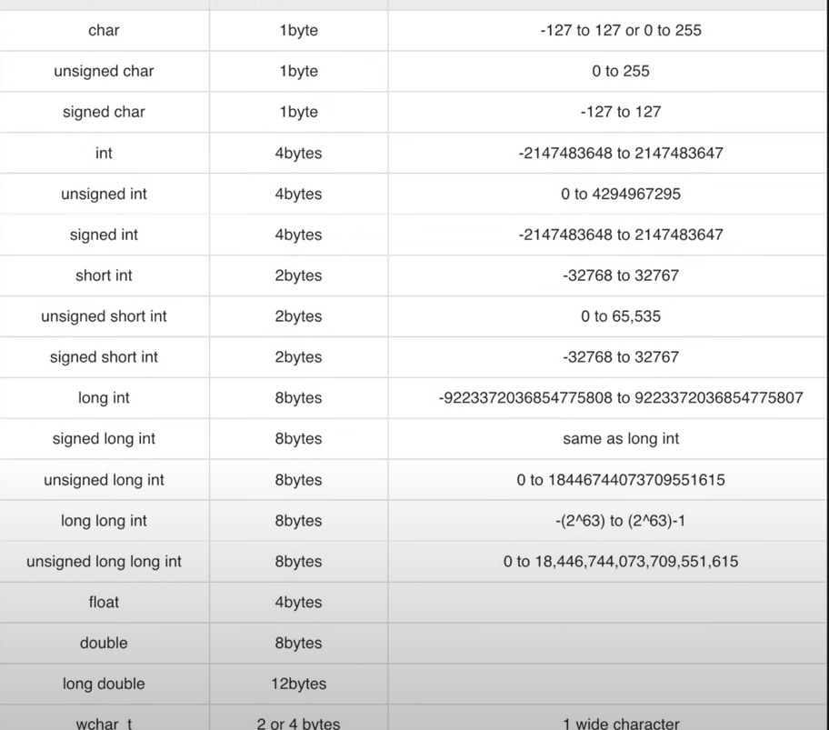

# LEARNING-DSA
Started learning DSA on 9th June 2025. I will be consistent this time.

---
## Day 1
- Learn about basic cpp syntax, 
- hello World print
- Data types (int, long, long long, float, double, char, string )
- `getline()` is used to take the hole string
- `One(1) byte = Eight(8) bits`

### Data  Types cheatsheet
